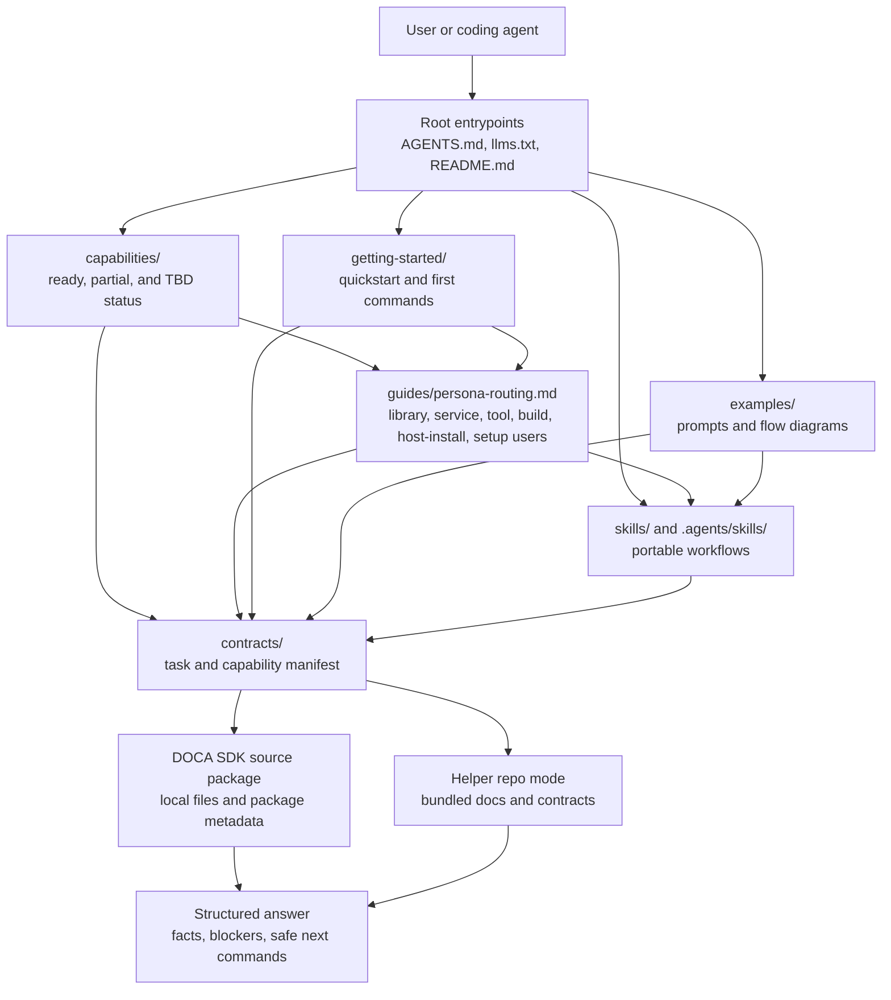

# DOCA Skills

Applies to: `NVIDIA-DOCA/doca-skills`
Read when: navigating DOCA AI guidance, portable skills, and source-package-tool procedures
Load next: `getting-started/README.md`, `guides/persona-routing.md`,
`capabilities/README.md`, `examples/README.md`, `contracts/agent-manifest.json`, `skills/doca-user-rules/SKILL.md`

This repository stores DOCA AI guidance, portable skills, and procedures for agents that work with DOCA SDK source
packages. It is a standalone helper payload: paths are written for this repository layout, and SDK facts come from the
source package path named in evidence commands.

## First Steps

Choose the mode first:

- Helper repository mode: read `getting-started/quickstart.md`, list bundled contracts, and verify the evidence
  procedures.
- SDK source package mode: keep this repository separate from the DOCA SDK source package and pass that source path to
  evidence commands.

For this helper repository:

```bash
find contracts -maxdepth 2 -type f \( -name '*.json' -o -name '*.yaml' \) -print
```

For source-package discovery:

```bash
find <source-package-root> -maxdepth 1 -name VERSION -print
find <source-package-root>/contracts -maxdepth 2 -type f \( -name '*.json' -o -name '*.yaml' \) -print 2>/dev/null
pkg-config --list-all 2>/dev/null | grep '^doca-' || true
```

For sample or application build planning:

```bash
find <sample-or-application-path> -maxdepth 2 \( -name meson.build -o -name meson.build \) -print
pkg-config --print-errors --exists <pkg-name>
```

## Repository Map

| Path | Purpose |
| --- | --- |
| `getting-started/` | Quickstart, first commands, setup, sample builds, SDK development, pkg-config, troubleshooting. |
| `reference/` | Common agent behavior, safety boundaries, and C/C++ style guidance. |
| `capabilities/` | Ready, partial, and TBD capability index for final users. |
| `contracts/` | Machine-readable capability and task contracts. |
| `examples/` | Prompt examples with expected agent flow diagrams. |
| `skills/` | Portable agent skills. |
| `.agents/skills/` | Symlinks for tools that discover Agent Skills from a standard location. |
| `development/`, `environment-setup/`, `troubleshooting/` | Topic routers for common SDK workflows. |
| `guides/` | Persona routing, capability, and source-package navigation guides. |
| `framework/` | DOCA Framework guide templates for libs, services, and drivers. |

## Architecture



## Boundary

The default procedures are read-only. They may inspect source files, package metadata, SDK headers, and local discovery
utilities. They must not install packages, mutate devices, change networking, write credentials, change persistent
configuration, run traffic, or execute runtime samples unless a local owner explicitly approves that action class
outside this repository's default flows.
