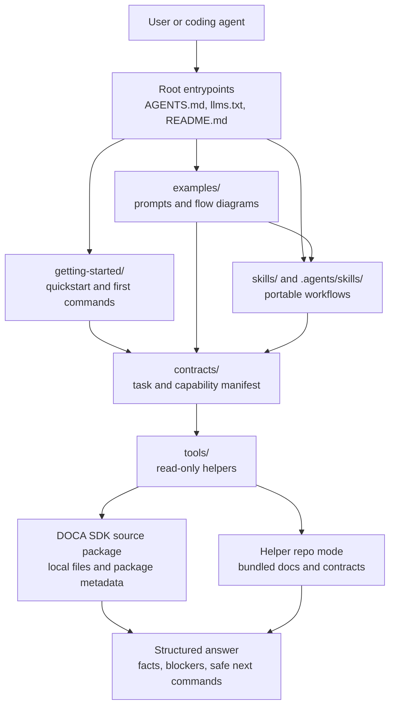

# DOCA Skills

Applies to: `NVIDIA-DOCA/doca-skills`
Read when: navigating DOCA AI guidance, portable skills, and helper tools
Load next: `getting-started/README.md`, `examples/README.md`,
`contracts/agent-manifest.json`, `skills/doca-user-rules/SKILL.md`

This repository stores DOCA AI guidance, portable skills, and helper tools for agents that work with DOCA SDK source
packages. It is a standalone helper payload: paths are written for this repository layout, and SDK facts come from the
source package passed to helper commands.

## First Steps

Choose the mode first:

- Helper repository mode: read `getting-started/quickstart.md`, list bundled contracts, and verify the helper tools.
- SDK source package mode: keep this repository separate from the DOCA SDK source package and pass that source root with
  `--repo-root`.

For this helper repository:

```bash
python3 tools/lookup_capability.py --repo-root . --list
```

For source-package discovery:

```bash
python3 tools/run_agent_task.py --task discover-doca-environment --repo-root <source-package-root>
```

For sample or application build planning:

```bash
python3 tools/run_agent_task.py --task build-sdk-sample --repo-root <source-package-root> \
    --focus-path <sample-or-application-path>
```

## Repository Map

| Path | Purpose |
| --- | --- |
| `getting-started/` | Quickstart, first commands, setup, sample builds, SDK development, pkg-config, troubleshooting. |
| `reference/` | Common agent behavior, safety boundaries, and C/C++ style guidance. |
| `contracts/` | Machine-readable capability and task contracts. |
| `examples/` | Prompt examples with expected agent flow diagrams. |
| `skills/` | Portable agent skills. |
| `.agents/skills/` | Symlinks for tools that discover Agent Skills from a standard location. |
| `tools/` | Small Python helpers for capability lookup, source-package discovery, and build planning. |
| `development/`, `environment-setup/`, `troubleshooting/` | Topic routers for common SDK workflows. |
| `guides/` | Higher-level capability and source-package navigation guides. |
| `modules/` | Module guide template and index for SDK areas that need focused context. |

## Architecture



## Boundary

The helper tools are read-only by default. They may inspect source files, package metadata, SDK headers, and local
discovery utilities. They must not install packages, mutate devices, change networking, write credentials, change
persistent configuration, run traffic, or execute runtime samples unless a local owner explicitly approves that action
class outside this repository's default flows.
