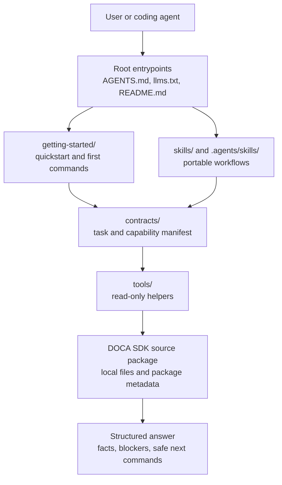

# DOCA Skills

Applies to: `NVIDIA-DOCA/doca-skills`
Read when: navigating public DOCA AI guidance, portable skills, and helper tools
Load next: `getting-started/README.md`, `contracts/agent-manifest.json`,
`skills/doca-user-rules/SKILL.md`

This repository stores public DOCA AI guidance, portable skills, and helper
tools for agents that work with DOCA SDK source packages. It is arranged as a
standalone public documentation and tooling payload: paths are written for this
repository layout.

## First Steps

1. Read `getting-started/quickstart.md`.
2. List available contracts with `python3 tools/lookup_capability.py --repo-root . --list`.
3. For source-package discovery, run `python3 tools/run_agent_task.py --task discover-doca-environment --repo-root <source-package-root>`.
4. For sample or application build planning, run `python3 tools/run_agent_task.py --task build-sdk-sample --repo-root <source-package-root> --focus-path <sample-or-application-path>`.

## Repository Map

| Path | Purpose |
| --- | --- |
| `getting-started/` | Quickstart, first commands, package setup, SDK development, pkg-config, troubleshooting, and validation guidance. |
| `reference/` | Common agent behavior, safety boundaries, and C/C++ style guidance. |
| `contracts/` | Machine-readable capability and task contracts. |
| `skills/` | Portable agent skills. |
| `.agents/skills/` | Symlinks for tools that discover Agent Skills from a standard location. |
| `tools/` | Small public Python helpers for capability lookup, source-package discovery, and build planning. |
| `development/`, `environment-setup/`, `troubleshooting/` | Topic routers for common SDK workflows. |
| `guides/` | Higher-level capability and source-package navigation guides. |
| `modules/` | Module guide template and index for SDK areas that need focused context. |
| `adapters/` | Optional editor or agent adapter templates. |

## Architecture

## Boundary

The public helper tools are read-only by default. They may inspect source files,
package metadata, public headers, and local discovery utilities. They must not
install packages, mutate devices, change networking, write credentials, change
persistent configuration, run traffic, or execute runtime samples unless a local
owner explicitly approves that action class outside this repository's default
flows.
