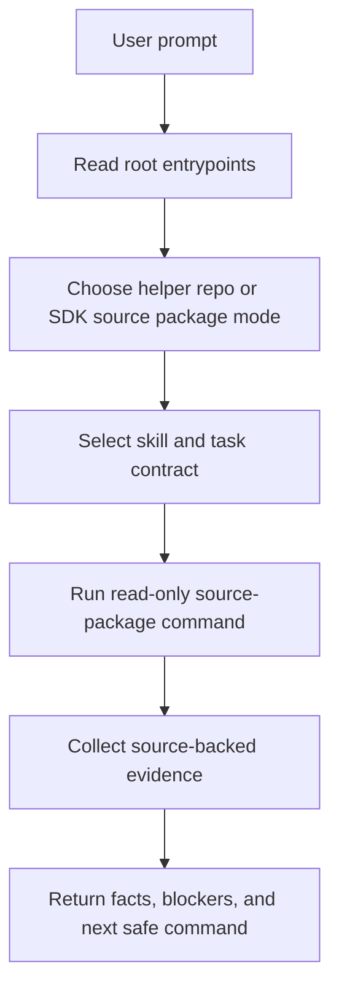

# Example Flows

Applies to: `NVIDIA-DOCA/doca-skills`
Read when: you want prompt examples and expected agent flow diagrams
Load next: `sdk-source-discovery.md`, `sample-build-planning.md`,
`capability-api-lookup.md`, `binary-context-install-map.example.json`

These examples show how this repository helps an agent move from a loose prompt to a source-backed answer. Each example
separates this helper repository from the DOCA SDK source package named as `<source-package-root>`.

| Example | Use when |
| --- | --- |
| `sdk-source-discovery.md` | The agent must identify the SDK source package and report blockers. |
| `sample-build-planning.md` | The agent must plan a sample or application build without host mutation. |
| `capability-api-lookup.md` | The agent must name SDK headers, dependencies, and API evidence. |
| `binary-context-install-map.example.json` | A package owner needs a schema-shaped passive binary context map example. |

## Common Flow

## Answer Standard

Every useful answer should state:

- Prompt intent.
- Guidance and skill files read.
- Evidence command run.
- SDK source package path used, or `not_provided`.
- Evidence found in files, metadata, headers, or contracts.
- Blocked actions and missing prerequisites.
- Exact next safe command.
