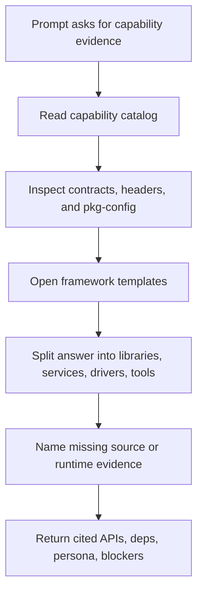

# Capability API Lookup

Applies to: SDK API, header, and dependency lookup with `doca-skills`
Read when: the user asks which headers, functions, packages, or framework persona applies
Load next: `../guides/capability-map.md`, `../framework/README.md`, `../skills/doca-explorer/SKILL.md`

## Prompt

```text
I need to use <capability-id>. Identify the SDK headers, functions, package
dependencies, examples, and whether this is mainly a library, service, driver, or tool
task. Use local source evidence before naming APIs.
```

## Expected Agent Flow



## Command Shape

```bash
grep -R "<symbol-or-topic>" <source-package-root>/libs/*/include/public 2>/dev/null
find <source-package-root> -path '*/version.map' -print 2>/dev/null
pkg-config --cflags --libs <pkg-name>
```

## Expected Answer Shape

- Capability ID and source package path.
- SDK headers and functions found by local source inspection.
- Package or pkg-config dependency evidence.
- `libraries_overview`, `services_overview`, `drivers_overview`, and `tools_overview` when relevant.
- Version, device, topology, or runtime facts that remain unknown.
- Next safe command for deeper source lookup or build planning.
