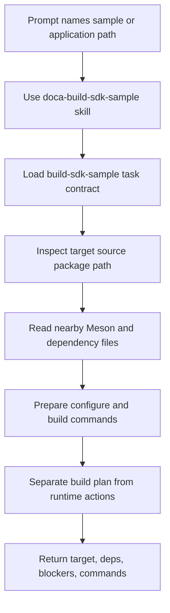

# Sample Build Planning

Applies to: DOCA SDK sample or application build planning with `doca-skills`
Read when: the user asks how to build a specific sample or application
Load next: `../getting-started/building-samples.md`, `../skills/doca-build-sdk-sample/SKILL.md`, `../contracts/tasks/build-sdk-sample.yaml`

## Prompt

```text
Plan how to build <sample-or-application-path> from my DOCA SDK source package.
Show the likely Meson target, dependencies, missing prerequisites, and commands.
Do not run the sample or change device, network, or package state.
```

## Expected Agent Flow



## Command Shape

```bash
find <sample-or-application-path> -maxdepth 2 \( -name meson.build -o -name meson.build \) -print
find <sample-or-application-path> -path '*/dependencies/meson.build' -print
pkg-config --print-errors --exists <pkg-name>
```

## Expected Answer Shape

- Target path and nearest build files.
- Package or pkg-config dependencies visible in source files.
- Helper sources or include directories that affect the build.
- Configure and build command candidates.
- Missing prerequisites that block a real build.
- Runtime steps that stay blocked until explicitly approved.
