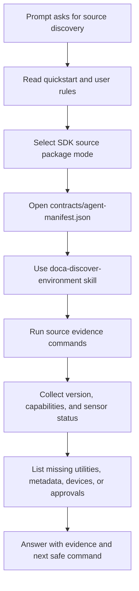

# SDK Source Discovery

Applies to: DOCA SDK source-package discovery with `doca-skills`
Read when: the user asks what SDK source package, contracts, or environment facts are available
Load next: `../getting-started/quickstart.md`, `../skills/doca-discover-environment/SKILL.md`, `../contracts/agent-manifest.json`

## Prompt

```text
I have a DOCA SDK source package at <source-package-root>. Tell me what source
version, helper contracts, capabilities, and blockers are visible. Do not change
the host.
```

## Expected Agent Flow



## Command Shape

```bash
find <source-package-root> -maxdepth 1 -name VERSION -print
find <source-package-root>/contracts -maxdepth 2 -type f \( -name '*.json' -o -name '*.yaml' \) -print 2>/dev/null
pkg-config --list-all 2>/dev/null | grep '^doca-' || true
```

## Expected Answer Shape

- Source package path: `<source-package-root>`.
- Source version: value found by the helper, or `unknown`.
- Capabilities: IDs returned by the manifest and capability catalog.
- Sensors: read-only commands that ran, were missing, or reported no devices.
- Blocked actions: package install, device mutation, network mutation, runtime samples, credentials.
- Next safe command: exact command to inspect one capability or retry discovery.
