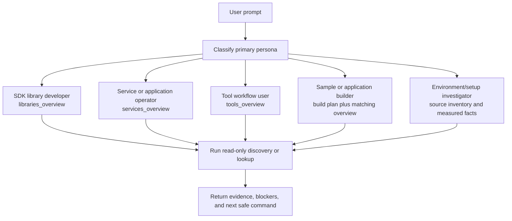

# DOCA Persona Routing

Applies to: DOCA source-package questions across libraries, services, tools, samples, and setup flows
Read when: a prompt names a user goal but not the DOCA guidance area to load
Load next: `guides/capability-map.md`, `modules/README.md`, then the matching skill

Use this router before choosing a skill or module template. Different DOCA users need different evidence, output shape,
and safety boundaries.

## Quick Match

| Persona | Usually Asks For | Start With | Return First | Do Not Do By Default |
| --- | --- | --- | --- | --- |
| SDK library developer | Headers, APIs, lifecycle, dependencies, sample usage. | `doca-programming-guide`, `doca-explorer`, `lookup_capability.py --api-index`. | `libraries_overview` with headers, APIs, dependencies, lifecycle, and gaps. | Invent APIs, assume runtime offload, or hide missing headers. |
| Service or application operator | Runtime prerequisites, configs, startup plan, observability, blocked actions. | `doca-discover-environment`, `doca-explorer`, service module template. | `services_overview` with prerequisites, safe discovery, health evidence, and blocked mutations. | Start services, run traffic, alter devices, change networking, or write credentials. |
| Tool workflow user | CLI use, build/debug helpers, validation commands, output files. | `doca-ai-runner`, `doca-explorer`, tool module template. | `tools_overview` with commands, inputs, outputs, safe commands, and approval-gated commands. | Mix read-only commands with commands that write build output or mutate runtime state. |
| Sample or application builder | Build target, Meson/pkg-config dependencies, include paths, build blockers. | `doca-build-sdk-sample`, `doca-ai-runner`, sample/application module guidance. | Build plan plus relevant library, service, or tool overview sections. | Execute runtime samples or install missing packages as part of planning. |
| Environment/setup investigator | Version, package metadata, local capabilities, topology, missing sensors. | `doca-discover-environment`, `doca-ai-runner`, validation guidance. | Source inventory, measured facts, `not_measured` facts, and next safe command. | Treat example PCI, interface, GPU, port, or peer values as local facts. |

## Routing Flow

## Response Contract

Every persona answer should include:

- `persona_route`: chosen persona, why it matched, and the guidance files read.
- `source_inventory`: package roots, headers, contracts, helper tools, and metadata used as evidence.
- The matching overview key: `libraries_overview`, `services_overview`, or `tools_overview`; sample/application builders
  may need more than one.
- `unmet_prerequisites`: missing paths, commands, packages, sensors, devices, or approvals.
- `blocked_actions`: action classes that require explicit local approval.
- `next_safe_command`: one command or file-inspection step that does not mutate system, device, network, credential, or
  persistent state.

If a prompt spans multiple personas, choose the primary user goal first and add secondary overview sections only when
they are needed to answer the question.
